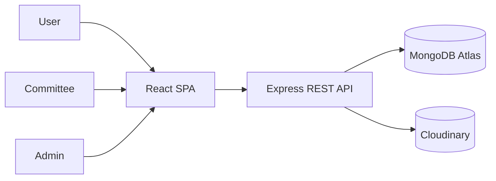
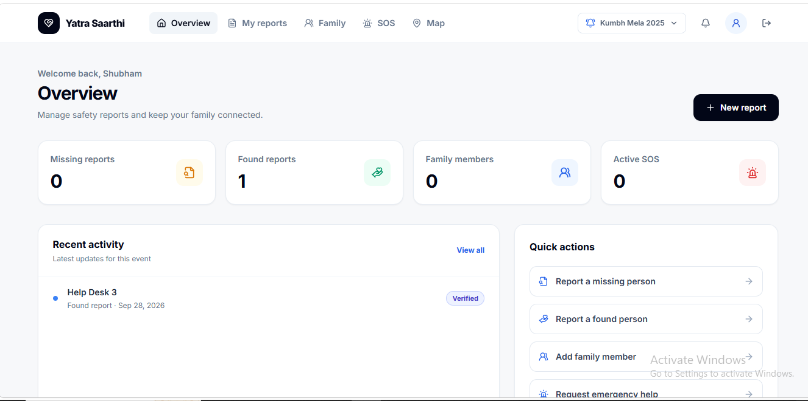
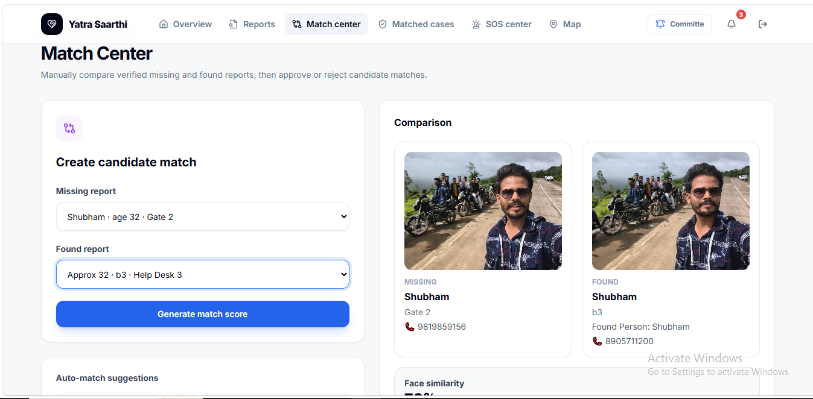
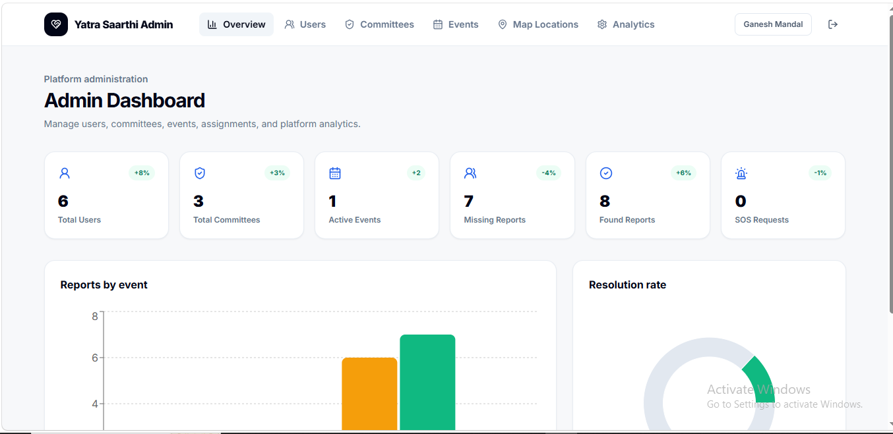

<div align="center">

# Yatra Saarthi

### Keeping crowds connected and families reunited.

[](https://crowd-management-tawny.vercel.app)
[](LICENSE)

**Frontend**


**Backend & Services**


</div>

## Contents

- [About](#about)
- [Architecture](#architecture)
- [Features](#features)
- [Status](#status)
- [Tech Stack](#tech-stack)
- [Quick Start](#quick-start)
- [API Summary](#api-summary)
- [Screenshots](#screenshots)
- [Deployment](#deployment)
- [Roadmap](#roadmap)
- [Contributors](#contributors)

## About

Yatra Saarthi is an event safety and missing-person coordination platform for
families, volunteers, committees, and administrators. It brings reporting,
verified response, maps, notifications, and reunification into one event-based
workflow.

## Architecture



## Features

### User

- 🔐 Register, sign in, recover accounts, and select an event.
- 📝 Create and track missing-person and found-person reports.
- 🆘 Submit SOS requests, manage family members, and receive notifications.
- 🗺️ View event safety locations and reunification progress.

### Committee

- 📊 Monitor reports, matches, SOS requests, and event activity.
- 🔎 Review candidates, approve matches, and prepare reunification tickets.
- 🗺️ Coordinate responders through event maps and verified updates.

### Admin

- 👥 Manage users, committees, events, and event assignments.
- 📍 Maintain safety locations and review platform analytics.

### AI Face Matching

- 🤖 Generate client-side face descriptors and calculate similarity scores.
- ✅ Surface top candidate pairs in the Match Center.

## Status

- ✅ Authentication and role-based access
- ✅ Missing and found reports
- ✅ Match Center and candidate matching
- ✅ Reunification workflow
- ✅ Event maps and safety locations
- ✅ Notifications
- ✅ AI face matching

## Tech Stack

| Layer     | Technology                                             |
| --------- | ------------------------------------------------------ |
| Frontend  | React, Vite, Tailwind CSS, React Router, React Leaflet |
| AI and UI | face-api.js, Lucide React, Recharts                    |
| Backend   | Node.js, Express, Mongoose                             |
| Services  | MongoDB Atlas, Cloudinary, JWT                         |

## Quick Start

```bash
# Backend
cd backend
npm install
cp .env.example .env
npm run dev

# In another terminal

cd frontend
npm install
cp .env.example .env
npm run dev
```

Set credentials in `backend/.env.example` copied to `backend/.env`. The key
values are `MONGODB_URI`, `JWT_SECRET`, and the Cloudinary credentials; set
`VITE_API_URL` in `frontend/.env` when the API is not using its local default.

Build the frontend with `cd frontend` followed by `npm run build`.

## API Summary

| Group           | Methods | Purpose                                         |
| --------------- | ------: | ----------------------------------------------- |
| Auth            |       4 | Registration, login, and password recovery      |
| Events          |       4 | Event listing and administration                |
| Missing Reports |       4 | Missing-person report lifecycle                 |
| Found Reports   |       4 | Found-person report lifecycle                   |
| Family Members  |       4 | Manage a user's event family members            |
| SOS             |       3 | Submit and update emergency requests            |
| Committee       |       7 | Review reports, matches, SOS, and reunification |
| Admin           |       9 | Manage users, committees, and map locations     |
| Map             |       1 | Retrieve event map locations                    |
| Reunification   |       1 | Retrieve reunification tickets                  |
| Notifications   |       2 | List and mark notifications read                |
| Health          |       1 | Service health check                            |

See the [complete API reference](docs/API.md) for every method, path, and description.

## Screenshots

<p align="center"></p>

<p align="center"></p>

<p align="center"></p>

Drop your screenshots in `docs/screenshots/`.

## Deployment

- Deploy `frontend/` to Vercel with the Vite framework preset.
- Set `VITE_API_URL` in Vercel to the deployed backend API URL.
- Deploy `backend/` to Render as a Node service.
- Use `npm start` as the Render start command and configure the backend environment variables.

## Roadmap

- Expand multilingual support for event communities.
- Extend location-aware coordination and reporting workflows.
- Add more operational analytics and response insights.

## Contributors

**Group CSE-B 03**

Member names: _to be added_.
